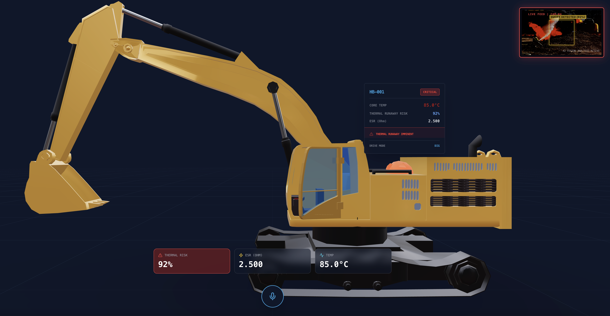
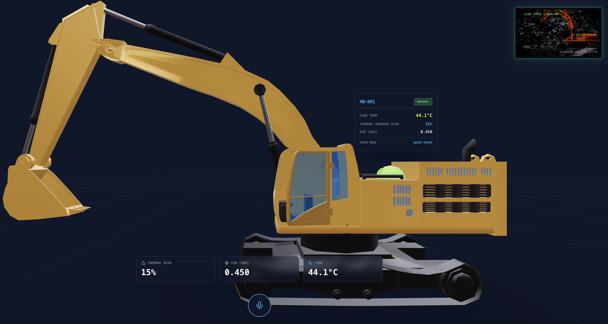
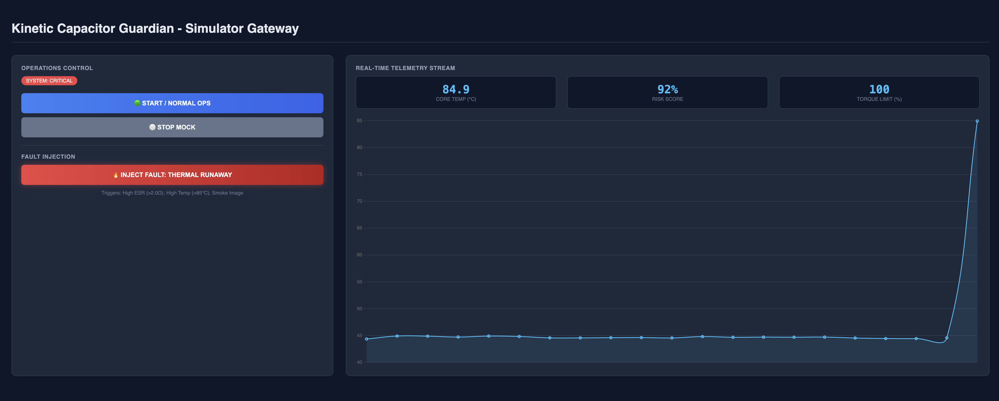
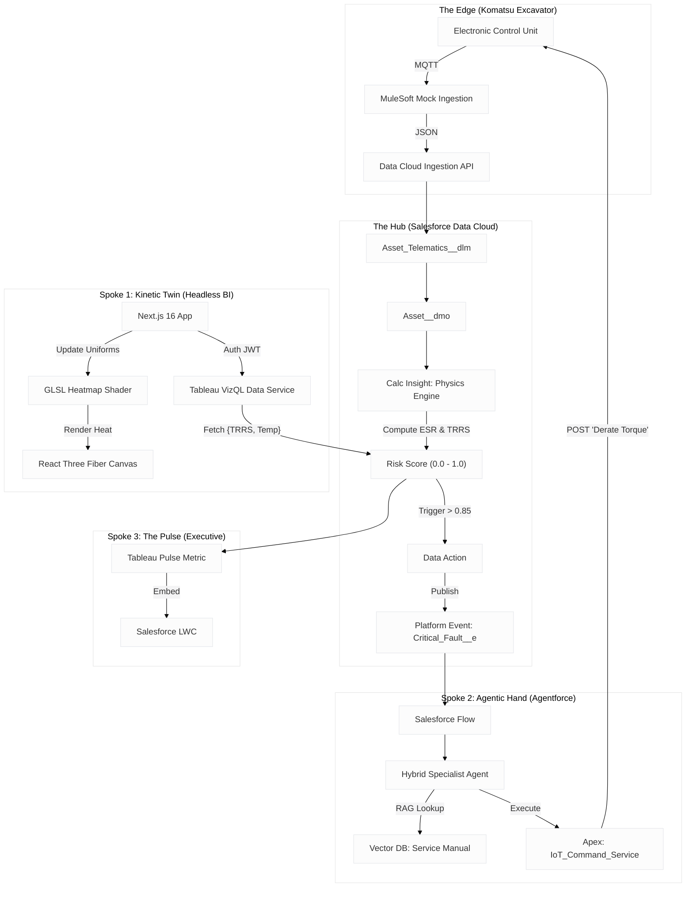

---

# Kinetic Capacitor Guardian: Autonomous Industrial Resilience System


> *Shifting the industrial paradigm from Passive Observation to Agentic Resilience.*

The **Kinetic Capacitor Guardian** is an autonomous "immune system" for the **Komatsu HB365LC-3 Hybrid Excavator**. By leveraging a **Hub & Spoke** architecture, it ingests high-frequency telemetry, calculates "invisible" physics indicators (ESR) in real-time, visualizes thermal risks via a **Headless 3D Digital Twin**, and empowers **Agentic AI** to physically intervene (derate torque) before catastrophic thermal runaway occurs.

---

[Kinetic Capacitor Guardian Frontend and PWA Digital Twin](https://kinetic-guardian-frontend-80514976508.us-central1.run.app/)





[Kinetic Capacitor Guardian Backend and Simulator Gateway](https://crm-kinetic-backend-be3-80514976508.us-central1.run.app)




## 🏗️ System Architecture

The solution utilizes a **Hub & Spoke** architectural pattern to decouple heavy data processing from the user experience and autonomous action layers.

### **The Hub & Spoke Ecosystem**

* **The Hub (Salesforce Data Cloud):** The central nervous system. It ingests raw telemetry, harmonizes it with semantic business context, and executes the **Physics Engine** (Calculated Insights) to compute the **Thermal Runaway Risk Score (TRRS)**.
* **Spoke 1 (The Kinetic Twin):** A **Headless BI** experience. A Next.js application that renders a high-fidelity 3D model of the excavator. It uses **Tableau VizQL Data Service** to fetch real-time risk scores that drive a custom **GLSL Shader**, visualizing heat generation directly on the 3D asset.
* **Spoke 2 (The Agentic Hand):** An **Agentforce** autonomous agent. When the Hub detects a critical risk (), it triggers this agent to cross-reference the **Service Manual (RAG)** and execute an **Apex Action** to physically "derate" the machine's torque, arresting the thermal runaway.
* **Spoke 3 (The Pulse):** **Tableau Pulse** embedded in Salesforce provides executive visibility into fleet efficiency and ROI.

### **Architecture Diagram**



---

## 🚀 Key Innovations

### 1. The Physics Engine (Calculated Insights)

We measure what sensors cannot. The system calculates **Equivalent Series Resistance (ESR)** in real-time using Ohm's Law on streaming data:


This derived metric allows us to predict capacitor failure hours before a temperature sensor would trigger an alarm.

### 2. Headless Analytics (VizQL + WebGL)

We moved beyond the 2D dashboard. By using **Tableau VizQL Data Service**, we feed raw analytical data directly into the **Uniforms** of a **WebGL Fragment Shader**.

* **Result:** As the data indicates risk, the 3D digital twin *physically glows red* and pulses, leveraging human cognitive intuition for "hot/dangerous."

### 3. Agentic Remediation

The system does not just report problems; it fixes them. The **Agentforce Hybrid Specialist**:

* **Detects** the anomaly via Data Cloud triggers.
* **Diagnoses** the root cause using RAG (Technical Manuals).
* **Intervenes** by sending an IoT command to "Limp Mode" the machine, saving a $30,000 component from destruction.

---

## 🛠️ Technology Stack

* **Backend / Hub:** Salesforce Data Cloud, MuleSoft (Mock), Calculated Insights (SQL).
* **Frontend (Kinetic Twin):** Next.js 16, React 19, React Three Fiber (Three.js), Tailwind CSS.
* **Data Access:** Tableau VizQL Data Service (Headless).
* **AI & Automation:** Agentforce, Einstein Trust Layer, Vector Database, Apex.
* **Executive View:** Tableau Pulse, Lightning Web Components (LWC).

---

## ⚙️ Installation & Deployment

### Prerequisites

* Salesforce Org with **Data Cloud** and **Agentforce** enabled.
* **Tableau Cloud** site with VizQL Data Service enabled.
* **Node.js v20+** and **npm**.

### 1. Data Cloud Configuration (The Hub)

1. **Ingestion:** Configure the Ingestion API connector.
2. **Data Model:** Map `Asset_Telematics__dlm` to `Asset__dmo` and `DeviceApplicationRead`.
3. **Calculated Insights:** Deploy the SQL queries for `CI_Capacitor_Physics` (ESR Calculation) and `TRRS_Score`.
4. **Triggers:** Set up the Data Action to publish `Hybrid_System_Critical__e` when `TRRS > 0.85`.

### 2. Agentforce Setup (The Hand)

1. **Agent Builder:** Create the "Hybrid System Specialist" agent.
2. **RAG:** Upload `Komatsu HB365LC-3 Service Manual.pdf` to the Data Cloud Vector Index.
3. **Actions:** Register the `IoT_Command_Service` Apex class as an Agent Action.
4. **Guardrails:** Configure the Trust Layer to block "Shutdown" commands but allow "Derate."

### 3. Kinetic Twin Deployment (The Headless Frontend)

1. Clone the repository:
```bash
git clone https://github.com/YourRepo/kinetic-capacitor-guardian.git
cd kinetic-capacitor-guardian

```


2. Install dependencies:
```bash
npm install

```


3. Configure Environment Variables (`.env.local`):
```env
TABLEAU_VIZQL_URL=https://prod-useast-b.online.tableau.com/api/v1/vizql
TABLEAU_CONNECTED_APP_ID=your_client_id
TABLEAU_CONNECTED_APP_SECRET=your_secret
TABLEAU_SITE_ID=your_site_id

```


4. Run the development server:
```bash
npm run dev

```


5. Access the Digital Twin at `http://localhost:3000`.

### 4. Running the Simulation

1. Execute the **Mock Ingestion Script** (`/scripts/mock_telemetry.py`) to start pushing high-heat telemetry to Data Cloud.
2. Watch the **Kinetic Twin**: The 3D excavator capacitor will transition from Blue to Pulsing Red.
3. Watch **Salesforce**: A Platform Event will fire, the Agent will wake up, and the "Derate" command will be logged in the debug console.

---

## 📜 License

This project is open-source and available under the **MIT License**.

---

*Built with ❤️ for the Future of Analytics.*